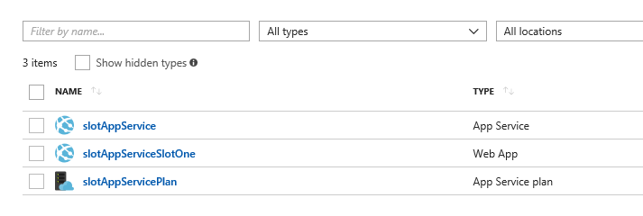
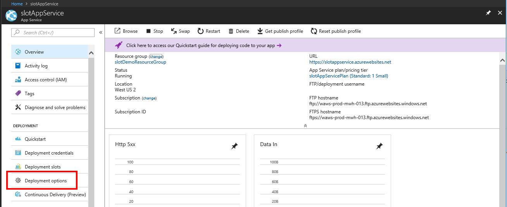

Terraform with Azure Provider Deployment Slot Walkthrough
===

In this walkthrough we will show you how to deploy two web apps via `GitHub` on `Azure`. One app will be assigned to the `Production Slot` and the second one will be hosted in the additional [deployment slot](https://docs.microsoft.com/en-us/azure/app-service/web-sites-staged-publishing) which we will provision with `Terraform`. Finally, we will use `Terraform` to swap the inactive slot with the `Production Slot`.

Using the [Azure Portal](https://portal.azure.com/) deploy a [Cloud Shell](https://docs.microsoft.com/en-us/azure/cloud-shell/overview), which is pre-configured with the latest version of `Terraform`. 

In the `Cloud Shell` bash window navigate to your `clouddrive` directory and create two directories, one called `deploy` and the other called `swap` as seen in the following image.


Navigate to your `deploy` directory and using `nano` copy and past the below `HCL` into a file called `deploy.tf`(i.e. `nano deploy.tf`).

```HCL
# Configure the Azure Provider
provider "azurerm" { }

resource "azurerm_resource_group" "slotDemo" {
  name = "slotDemoResourceGroup"
  location = "westus2"
}

resource "azurerm_app_service_plan" "slotDemo" {
  name                = "slotAppServicePlan"
  location            = "${azurerm_resource_group.slotDemo.location}"
  resource_group_name = "${azurerm_resource_group.slotDemo.name}"
  sku {
    tier = "Standard"
    size = "S1"
  }
}

resource "azurerm_app_service" "slotDemo" {
  name                = "slotAppService"
  location            = "${azurerm_resource_group.slotDemo.location}"
  resource_group_name = "${azurerm_resource_group.slotDemo.name}"
  app_service_plan_id = "${azurerm_app_service_plan.slotDemo.id}"
}

resource "azurerm_app_service_slot" "slotDemo" {
  name                = "slotAppServiceSlotOne"
  location            = "${azurerm_resource_group.slotDemo.location}"
  resource_group_name = "${azurerm_resource_group.slotDemo.name}"
  app_service_plan_id = "${azurerm_app_service_plan.slotDemo.id}"
  app_service_name    = "${azurerm_app_service.slotDemo.name}"
}
```
Once you have created the `deploy.tf` file you can now provision your resources to `Azure` using `Terraform` by typing the following commands.

* terraform init
* terraform plan
* terraform apply

Once `Terraform` has completed provisioning the resources you can use the `Resource Groups` tab in the `Azure Portal` to see the resources that were just provisioned by `Terraform`.


Click on the `slotDemoResourceGroup` and this will show each of the resources that were created.



We now need to deploy our bits via `GitHub` to our `slotAppService ProductionSlot`, in the `Azure Portal` click on the `slotAppService` resource, then click on `Deployment options`, as seen in the following image.




```HCL
# Configure the Azure Provider
provider "azurerm" { }

resource "azurerm_resource_group" "slotDemo" {
  name = "slotDemoResourceGroup"
  location = "westus2"
}

resource "azurerm_app_service_plan" "slotDemo" {
  name                = "slotAppServicePlan"
  location            = "${azurerm_resource_group.slotDemo.location}"
  resource_group_name = "${azurerm_resource_group.slotDemo.name}"
  sku {
    tier = "Standard"
    size = "S1"
  }
}

# Swap the Production Slot with the Deployment Slot
resource "azurerm_app_service_active_slot" "slotDemoActiveSlot" {
  resource_group_name   = "slotDemoResourceGroup"
  app_service_name      = "slotAppService"
  app_service_slot_name = "slotappServiceSlotOne"
}
```
